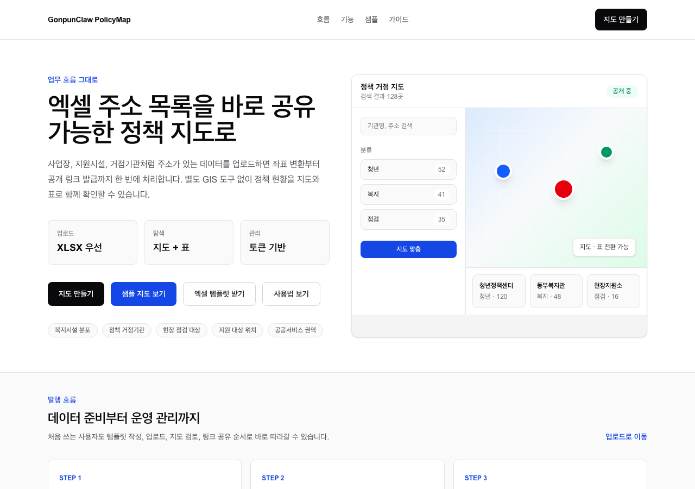
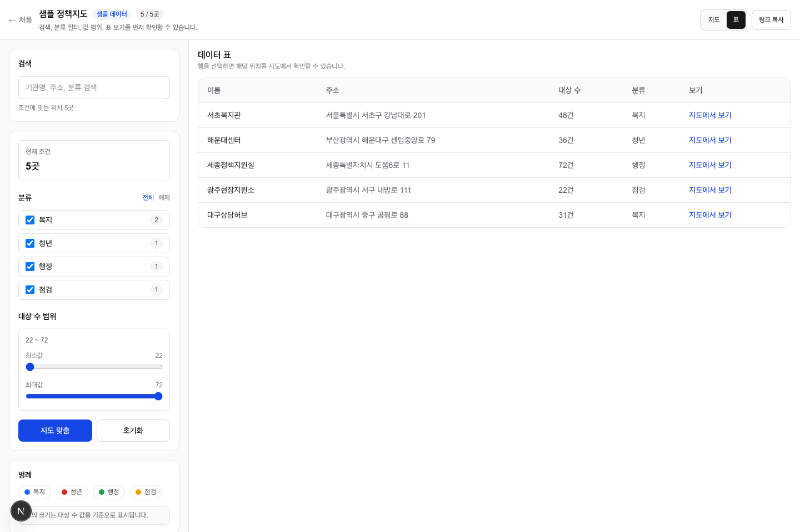

<p align="center">
  <strong>GonpunClaw PolicyMap</strong>
</p>

<p align="center">
  주소가 들어 있는 엑셀만 올리면 공개 정책 지도를 만들 수 있는 셀프서비스 맵 퍼블리셔
</p>

<p align="center">
  <a href="https://gonpunclaw-policymap.vercel.app">Live</a>
  ·
  <a href="https://gonpunclaw-policymap.vercel.app/demo">샘플 지도</a>
  ·
  <a href="https://gonpunclaw-policymap.vercel.app/upload">지도 만들기</a>
  ·
  <a href="./docs/USER-GUIDE-KO.md">사용자 가이드</a>
  ·
  <a href="./docs/sample-upload-template.xlsx">XLSX 템플릿</a>
</p>

<p align="center">
  <a href="https://gonpunclaw-policymap.vercel.app">
    
  </a>
  <a href="https://gonpunclaw-policymap.vercel.app/upload">
    
  </a>
  <a href="./docs/USER-GUIDE-KO.md">
    
  </a>
  <a href="./docs/sample-upload-template.xlsx">
    
  </a>
</p>

---

GonpunClaw PolicyMap은 주소가 들어 있는 시트를 업로드하면 자동으로 좌표를 찾고, 공유 가능한
정책 지도를 만들어 주는 웹 앱입니다. 사용자는 별도 GIS 도구 없이 주소 목록을 지도와 표로 함께
확인할 수 있습니다.

## 화면 미리보기





## 한눈에 보기

| 작업 | 지원 내용 |
| --- | --- |
| 지도 발행 | 엑셀 업로드로 주소 목록을 지도 데이터로 변환 |
| 진행 상태 | 업로드 작업을 분리해 주소 변환 진행률과 성공/실패 개수를 표시 |
| 작업 보호 | 업로드 작업 전용 토큰과 작업 잠금으로 중복 처리 방지 |
| 좌표 변환 | 국내 주소용 지오코더 폴백 처리 |
| 공개 공유 | 공개 지도 링크와 관리 페이지 발급 |
| 데이터 탐색 | 검색, 분류 필터, 값 범위 필터, 범례, 표 보기 |
| 사전 체험 | 샘플 지도로 업로드 전 결과 화면 확인 |
| 관리 | 관리 토큰으로 제목, 설명, 컬럼 라벨, 공개 여부, 엑셀 데이터 교체, CSV 내보내기, 실패 주소 재시도, 삭제 |
| 운영 | 신고 상태 관리, 감사 로그, DB 기반 요청 제한, 업로드 작업 자동 재개/정리 |

## 빠른 시작

1. 템플릿을 내려받습니다.
   - 앱에서 바로 받기: [`/template.xlsx`](https://gonpunclaw-policymap.vercel.app/template.xlsx)
   - 저장소 파일: [`docs/sample-upload-template.xlsx`](./docs/sample-upload-template.xlsx)
2. A열 주소, B열 이름, C열 대표값, D열 분류를 채웁니다.
3. [`/upload`](https://gonpunclaw-policymap.vercel.app/upload)에 업로드합니다.
4. 주소 변환 진행률을 확인합니다.
5. 발급된 공개 지도 링크를 공유하고, 관리 페이지와 관리 토큰은 내부에만 보관합니다.

결과 화면을 먼저 보고 싶다면 [`/demo`](https://gonpunclaw-policymap.vercel.app/demo)에서
샘플 데이터를 확인할 수 있습니다.

## 주요 화면

- `/` — 정책 지도 발행 흐름, 지도 미리보기, 업로드/템플릿/가이드 진입점
- `/demo` — 업로드 없이 확인하는 샘플 공개 지도
- `/upload` — 지도 기본 정보, 컬럼 표시 이름, 엑셀 파일 선택
- `/m/[slug]` — 공개 지도 검색, 필터, 범례, 표 보기
- `/manage/[slug]` — 업로드한 지도 정보 수정, 엑셀 데이터 교체, CSV 내보내기, 실패 주소 재시도, 비공개 전환 및 삭제

## 파일 형식

업로드 파일은 XLSX를 권장합니다. CSV도 지원하지만 스프레드시트 저장 방식에 따라 헤더나
인코딩 해석이 흔들릴 수 있습니다.

한 행은 지도에 표시될 위치 1개입니다. 여러 항목을 넣으려면 데이터 행을 추가하세요.
여러 시트가 있어도 첫 번째 시트만 읽습니다.
E열 이후는 공개 지도 팝업에 표시되므로 전화번호, 이메일, 계좌, 상세주소 같은 민감 컬럼은
업로드 전 제거해야 합니다. 서버에서도 민감 컬럼명을 감지하면 업로드를 거부합니다.

예를 들어 아래 한 줄은 지도에서 `예시복지관` 위치 1개로 표시됩니다.

| A열 주소 | B열 이름 | C열 대표값 | D열 분류 | E열 이후 |
| --- | --- | --- | --- | --- |
| 서울 서초구 반포대로 58 | 예시복지관 | 48 | 복지 | 담당부서, 비고 |

| 열 | 의미 | 예시 |
| --- | --- | --- |
| A열 | 주소 | 세종특별자치시 도움6로 11 |
| B열 | 이름 | 정부세종청사 |
| C열 | 대표값 | 100 |
| D열 | 분류 | 행정 |
| E열 이후 | 공개 팝업에 표시될 추가 정보 | 담당부서, 비고 등 |

자세한 사용법은 [사용자 가이드](./docs/USER-GUIDE-KO.md)를 확인하세요.

## 기술 구성

| 영역 | 스택 |
| --- | --- |
| App | Next.js App Router, React, TypeScript, Tailwind CSS |
| Map | MapLibre GL, OpenStreetMap raster tiles, marker clustering |
| Data | Supabase, server route handlers |
| Geocoding | 국내 주소 지오코딩 폴백 체인 |
| Test | Vitest, Playwright |

## 개발

```bash
npm install
npm run dev          # http://localhost:3000
npm run lint
npm test
npm run test:e2e
npm run build
```

로컬 실행에는 `.env.example`을 참고해 `.env.local`을 구성해야 합니다. 실제 운영 환경값이나
비밀키는 공개 저장소에 기록하지 않습니다.

운영 배포에서는 `CRON_SECRET`을 설정합니다. `vercel.json`의 Cron이
`/api/cron/process-upload-jobs`를 주기적으로 호출해 브라우저가 닫힌 업로드 작업을 이어 처리하고,
완료된 작업 원본 행은 일정 기간 뒤 정리합니다.

## 테스트 범위

- 랜딩 페이지 주요 CTA 노출 및 데스크톱/모바일 가로 overflow 방지
- 업로드 폼의 필수 입력 준비 상태와 파일 선택/해제 UX
- 공개 지도 필터 로직과 빈 상태 안내
- 업로드 성공 화면의 공개 지도, 관리 페이지, 관리 토큰 액션
- 비동기 업로드 작업 API, 작업 토큰, 모바일 필터 패널, 관리 페이지 데이터 교체/CSV/재시도 안내
- 신고 상태 한글 라벨과 삭제 요청 rate limit

## 문서

- [사용자 가이드](./docs/USER-GUIDE-KO.md)
- [XLSX 템플릿](./docs/sample-upload-template.xlsx)
- [CSV 샘플](./docs/sample-upload-template.csv)
