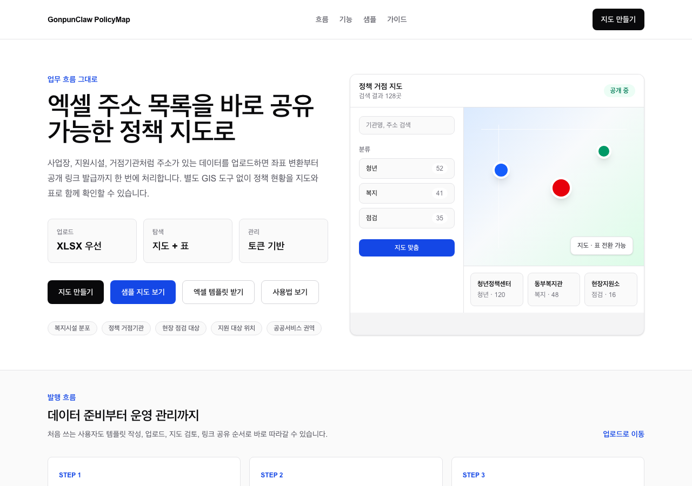
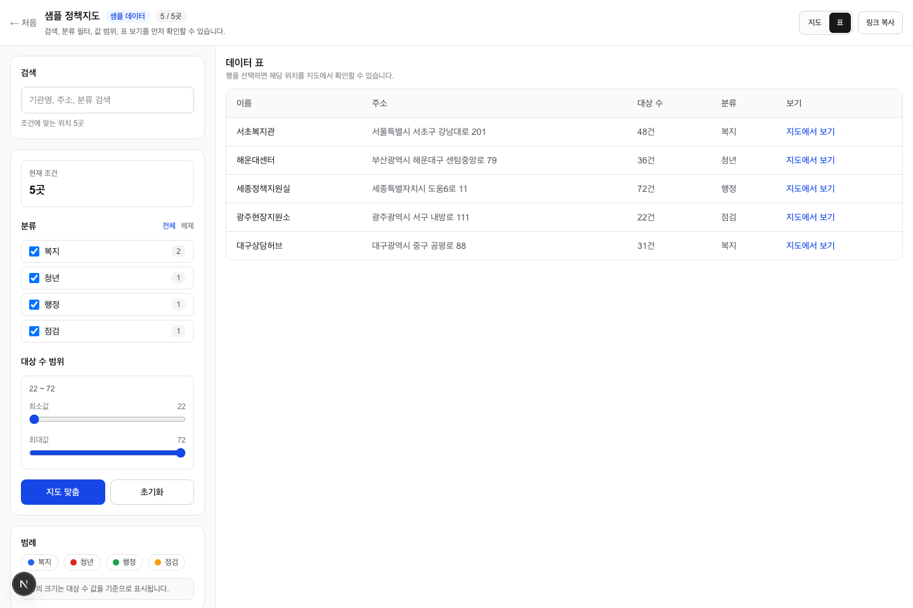

<p align="center">
  <strong>GonpunClaw PolicyMap</strong>
</p>

<p align="center">
  기존 업무 엑셀을 검수해 출처가 보이는 정책지도로 발행하는 셀프서비스 맵 스튜디오
</p>

<p align="center">
  <a href="https://gonpunclaw-policymap.vercel.app">Live</a>
  ·
  <a href="https://gonpunclaw-policymap.vercel.app/demo">샘플 지도</a>
  ·
  <a href="https://gonpunclaw-policymap.vercel.app/upload">지도 만들기</a>
  ·
  <a href="https://gonpunclaw-policymap.vercel.app/guide">라이브 사용법</a>
  ·
  <a href="https://gonpunclaw-policymap.vercel.app/templates">업무별 템플릿</a>
  ·
  <a href="./docs/USER-GUIDE-KO.md">사용자 가이드</a>
  ·
  <a href="./docs/sample-upload-template.xlsx">XLSX 템플릿</a>
</p>

<p align="center">
  <a href="https://gonpunclaw-policymap.vercel.app">
    
  </a>
  <a href="https://gonpunclaw-policymap.vercel.app/upload">
    
  </a>
  <a href="./docs/USER-GUIDE-KO.md">
    
  </a>
  <a href="./docs/sample-upload-template.xlsx">
    
  </a>
</p>

---

GonpunClaw PolicyMap은 기존 업무 엑셀을 업로드하면 열 역할과 공개 범위를 확인하고, 주소 품질을
검수한 뒤 출처·기준일이 표시되는 정책지도로 발행하는 웹 앱입니다. 사용자는 별도 GIS 도구 없이
주소 목록을 지도와 표로 함께 확인할 수 있습니다.

## 화면 미리보기





- 라이브 URL: https://gonpunclaw-policymap.vercel.app
- 업로드 페이지: https://gonpunclaw-policymap.vercel.app/upload
- 에이전트 안내: https://gonpunclaw-policymap.vercel.app/llms.txt
- 사용자 가이드: [`docs/USER-GUIDE-KO.md`](docs/USER-GUIDE-KO.md)
- 업로드 템플릿: [`docs/sample-upload-template.xlsx`](docs/sample-upload-template.xlsx)

## 한눈에 보기

| 작업 | 지원 내용 |
| --- | --- |
| 파일 사전검사 | XLSX/XLS/CSV, 여러 시트, 헤더·빈 행·중복 가능 행·값 변환 통계 확인 |
| 열 연결 | 주소·이름·대표값·분류를 추천하고 공개 추가정보 열을 개별 선택 |
| 민감정보 보호 | 위험 헤더·표본 값을 검사하고 고위험 정보는 발행 차단 |
| 지도 발행 | 검수 완료한 주소 목록을 지도 데이터로 변환 |
| 진행 상태 | 업로드 작업을 분리해 주소 변환 진행률과 성공/실패 개수를 표시 |
| 작업 보호 | 업로드 작업 전용 토큰과 작업 잠금으로 중복 처리 방지 |
| 좌표 품질 | 국내 주소용 지오코더 폴백 처리와 성공·검수 필요·실패 분류 |
| 공개 전 확인 | 출처·기준일·관리 주체·공개 범위와 검수 결과 확인 |
| 공개 공유 | 공개·링크 보유자·비공개 지도와 관리 페이지 발급 |
| 데이터 탐색 | 검색, 분류 필터, 값 범위 필터, 범례, 표 보기 |
| 경계 확인 | VWorld 2D 데이터 API로 시군구 경계 레이어 표시 |
| R2 요약 | 조건·현재 지도 범위의 개수, 분류·행정구역 분포, 대표값 합계·중앙값, 집계 CSV |
| 정책 기준 레이어 | 행정안전부 기준 인구감소지역 89개·관심지역 18개 선택 및 지역별 필터 |
| 업무 템플릿 | 복지시설, 생활SOC, 사회적경제기업, 빈집·유휴공간, 안전점검, 관광자원 XLSX |
| 버전 관리 | 데이터 교체·발행 스냅샷, 추가·삭제·변경·좌표 변경 요약, 이전 버전 복원 |
| 사전 체험 | 샘플 지도로 업로드 전 결과 화면 확인 |
| 관리 | 관리 토큰으로 제목, 설명, 컬럼 라벨, 공개 여부, 엑셀 데이터 교체, CSV 내보내기, 실패 주소 재시도, 삭제 |
| 운영 | 신고 상태 관리, 감사 로그, DB 기반 요청 제한, 업로드 작업 자동 재개/정리 |

## 빠른 시작

1. 템플릿을 내려받습니다.
   - 앱에서 바로 받기: [`/template.xlsx`](https://gonpunclaw-policymap.vercel.app/template.xlsx)
   - 저장소 파일: [`docs/sample-upload-template.xlsx`](./docs/sample-upload-template.xlsx)
2. [`/upload`](https://gonpunclaw-policymap.vercel.app/upload)에서 파일을 선택하고 사용할 시트와 열 역할을 확인합니다.
3. 주소 변환 진행률을 확인하고 검수 필요·실패 행을 수정하거나 제외합니다.
4. 출처, 기준일, 관리 주체와 공개 범위를 입력해 발행합니다.
5. 발급된 링크를 공유하고, 관리 페이지와 관리 토큰은 내부에만 보관합니다.

결과 화면을 먼저 보고 싶다면 [`/demo`](https://gonpunclaw-policymap.vercel.app/demo)에서
샘플 데이터를 확인할 수 있습니다.

## 주요 화면

- `/` — 정책 지도 발행 흐름, 지도 미리보기, 업로드/템플릿/가이드 진입점
- `/demo` — 업로드 없이 확인하는 샘플 공개 지도
- `/guide` — 앱 안에서 보는 단계별 사용법과 문제 해결 안내
- `/templates` — 정책업무별 권장 열, 공개 주의사항, XLSX 다운로드
- `/upload` — 파일 사전검사, 시트·열 연결, 주소 검수, 메타데이터와 공개 전 확인
- `/m/[slug]` — 공개 지도 검색, 필터, 범례, 표 보기
- `/manage/[slug]` — 업로드한 지도 정보 수정, 엑셀 데이터 교체, CSV 내보내기, 실패 주소 재시도, 비공개 전환 및 삭제
- `/manage/[slug]/versions` — 버전별 변경점 확인 및 이전 버전 복원

## 파일 형식

업로드 파일은 XLSX를 권장합니다. XLS, CSV도 지원합니다. 기본 제한은 10,000행·3MB이며
운영 환경에서는 `MAX_UPLOAD_BYTES`로 파일 크기를 조정할 수 있습니다.

한 행은 지도에 표시될 위치 1개입니다. 여러 항목을 넣으려면 데이터 행을 추가하세요.
여러 시트가 있으면 사용할 시트를 선택합니다. 헤더와 표본 값을 바탕으로 주소·이름·대표값·분류
역할을 추천하지만, 사용자가 직접 바꿀 수 있습니다. 주소 열만 필수입니다.
추가정보는 공개할 열만 선택하며, 선택하지 않은 열은 지도 마커에 저장하지 않습니다. 전화번호,
이메일, 계좌, 주민번호, 상세주소 같은 민감 정보는 검사 대상이며 고위험 정보가 선택되면 발행이
차단됩니다.

예를 들어 아래 한 줄은 지도에서 `예시복지관` 위치 1개로 표시됩니다.

| 주소 열 | 이름 열 | 대표값 열 | 분류 열 | 공개 추가정보 |
| --- | --- | --- | --- | --- |
| 서울 서초구 반포대로 58 | 예시복지관 | 48 | 복지 | 담당부서, 비고 |

| 열 | 의미 | 예시 |
| --- | --- | --- |
| 주소 열 | 주소 | 세종특별자치시 도움6로 11 |
| 이름 열 | 이름 | 정부세종청사 |
| 대표값 열 | 숫자로 변환할 값 | 100 |
| 분류 열 | 필터에 사용할 분류 | 행정 |
| 공개 추가정보 | 공개 팝업에 표시할 선택 정보 | 담당부서, 비고 등 |

자세한 사용법은 라이브 앱의 [사용법 페이지](https://gonpunclaw-policymap.vercel.app/guide)나
[문서형 사용자 가이드](./docs/USER-GUIDE-KO.md)를 확인하세요.

## 기술 구성

| 영역 | 스택 |
| --- | --- |
| App | Next.js App Router, React, TypeScript, Tailwind CSS |
| Map | MapLibre GL, OpenStreetMap raster tiles, marker clustering |
| Data | Supabase, server route handlers |
| Geocoding / Boundary | 국내 주소 지오코딩 폴백 체인, VWorld 시군구 경계 |
| Test | Vitest, Playwright |

## 개발

필수 도구:

- Node.js 20 이상
- Docker Desktop 또는 Docker 호환 런타임
- Supabase CLI는 `npx supabase`로 실행합니다. `npm install -g supabase` 전역 설치는 사용하지 않습니다.

```bash
npm install
npm run dev          # http://localhost:3000
npm run lint
npm test
npm run test:e2e
npm run build
```

로컬 실행에는 `.env.example`을 참고해 `.env.local`을 구성해야 합니다. 실제 운영 환경값이나
비밀키는 공개 저장소에 기록하지 않습니다.

공개 지도에서 `행정구역 경계 표시`를 켜면 `public/data/sido-boundaries.geojson`,
`public/data/sigg-boundaries.geojson`, `public/data/emd-boundaries.geojson` 정적 파일을
읽어 광역시도/시군구/읍면동 경계를 표시합니다. 이 파일은 VWorld Data API 2.0
`LT_C_ADSIDO_INFO`, `LT_C_ADSIGG_INFO`, `LT_C_ADEMD_INFO`에서 받은 경계를 지도 표시용으로
단순화한 데이터입니다.

`정책 기준 레이어`를 켜면 `src/data/population-region-index-with-codes.json`의 공통 시군구 코드와
시군구 경계를 결합해 인구감소지역 89개·인구감소관심지역 18개를 표시합니다. 기준 데이터는
행정안전부 지정 고시(2024-15, 2025-78)를 바탕으로 하며, 화면에서 출처와 기준일을 확인할 수 있습니다.

경계 데이터를 갱신할 때만 `VWORLD_API_KEY`와 필요 시 `VWORLD_DOMAIN`을 설정해 아래 명령을
실행합니다. API 키는 `.env.local`이나 Vercel env에만 두고 커밋하지 않습니다.

```bash
npm run gen:boundaries
```

### 로컬 Supabase 실행

저장소에는 `supabase/migrations`가 포함되어 있어 로컬 DB를 같은 구조로 올릴 수 있습니다.

```bash
npx supabase start
```

처음 실행하면 Docker 이미지 다운로드 때문에 시간이 걸립니다. 실행이 끝나면 CLI가 로컬
Project URL, REST URL, DB URL, Publishable key, Secret key를 출력합니다. 이 값으로
`.env.local`을 채우고 Next.js 개발 서버를 실행합니다.

```bash
NEXT_PUBLIC_SUPABASE_URL=http://127.0.0.1:54321
SUPABASE_SERVICE_ROLE_KEY=<supabase start가 출력한 Secret key>
ADMIN_TOKEN_PEPPER=<openssl rand -hex 32 결과>
STAFF_DASHBOARD_TOKEN=<로컬에서 사용할 임의 토큰>
CRON_SECRET=<로컬에서 사용할 임의 토큰>
MAX_UPLOAD_BYTES=3145728
UPLOAD_RETENTION_DAYS=30
```

로컬 작업을 끝낼 때는 DB 데이터를 유지하려면 아래 명령을 사용합니다.

```bash
npx supabase stop
```

CLI 업그레이드나 로컬 DB를 깨끗하게 다시 만들기 전에는 필요한 스키마와 데이터를 먼저 백업합니다.

```bash
npx supabase db diff -f my_schema
npx supabase db dump --local --data-only > supabase/seed.sql
npx supabase stop --no-backup
```

원격 Supabase에 배포할 때는 운영 프로젝트를 링크한 뒤 마이그레이션을 적용합니다. 프로젝트 ref,
DB 비밀번호, 서비스 키는 공개 문서나 커밋에 남기지 않습니다.

```bash
npx supabase link --project-ref <project-ref>
npx supabase migration list
npx supabase db push
```

`Could not find the table 'public.upload_jobs' in the schema cache` 오류가 나면 먼저 운영 앱이
마이그레이션을 적용한 Supabase 프로젝트를 보고 있는지 확인합니다. 특히 Vercel Production의
`NEXT_PUBLIC_SUPABASE_URL`과 `SUPABASE_SERVICE_ROLE_KEY`가 같은 프로젝트의 값이어야 합니다.
DB에 테이블이 있는지는 아래처럼 확인할 수 있습니다.

```bash
npx supabase db query "select to_regclass('public.upload_jobs') as upload_jobs;" --linked
```

운영 배포에서는 `CRON_SECRET`을 설정합니다. `vercel.json`의 일일 Cron이
`/api/cron/process-upload-jobs`를 호출해 브라우저가 닫힌 업로드 작업을 이어 처리하고,
완료된 작업 원본 행은 일정 기간 뒤 정리합니다. 더 잦은 자동 재개가 필요하면 Vercel Pro 이상의
Cron 주기로 조정합니다.

## 테스트 범위

- 랜딩 페이지 주요 CTA 노출 및 데스크톱/모바일 가로 overflow 방지
- 업로드 폼의 필수 입력 준비 상태와 파일 선택/해제 UX
- 공개 지도 필터 로직과 빈 상태 안내
- 업로드 성공 화면의 공개 지도, 관리 페이지, 관리 토큰 액션
- 비동기 업로드 작업 API, 작업 토큰, 모바일 필터 패널, 관리 페이지 데이터 교체/CSV/재시도 안내
- 파일 사전검사·동적 열 연결·민감정보 검사·메타데이터 검증·주소 품질 분류
- R2 대시보드 집계·정책 레이어·공통 지역 인덱스·버전 변경점 계산
- 신고 상태 한글 라벨과 삭제 요청 rate limit

## 문서

- [사용자 가이드](./docs/USER-GUIDE-KO.md)
- [XLSX 템플릿](./docs/sample-upload-template.xlsx)
- [CSV 샘플](./docs/sample-upload-template.csv)
